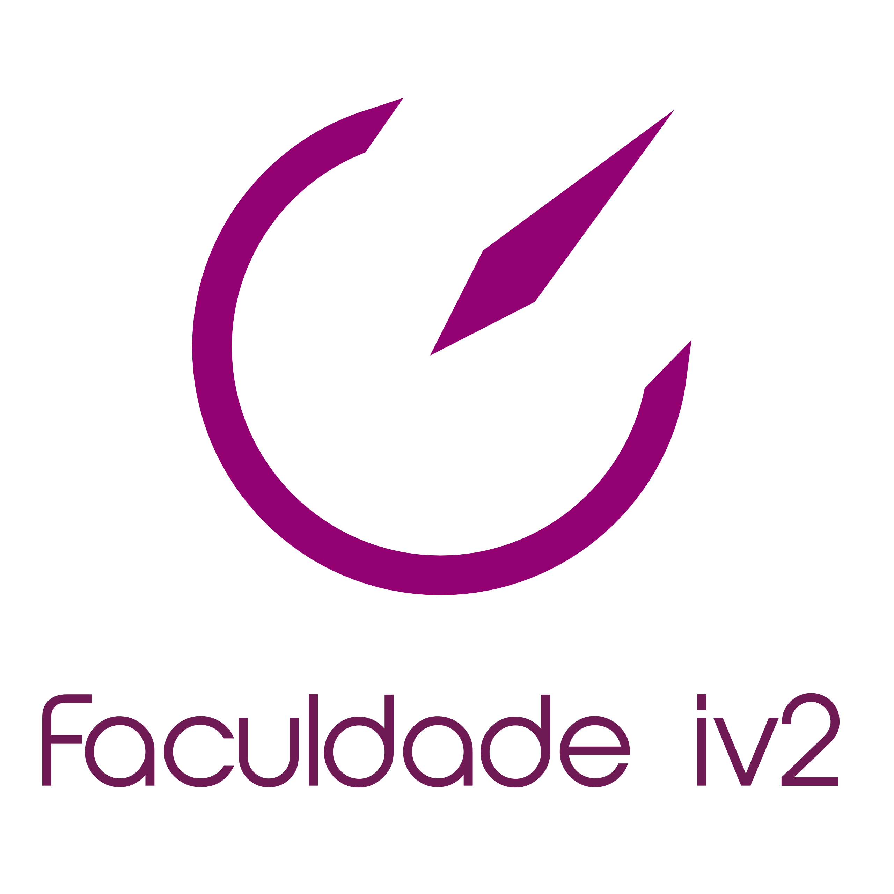

<<<<<<< HEAD
# Curso Beginner Faculdade IV2
> Exercicios e Projetos feitos durante o curso Beginner da faculdade IV2.

## 💻 Sobre o projeto Curso Beginner Faculdade IV2

No curso Beginner garantimos uma experiência completa de aprendizagem para você que deseja iniciar a carreira de programação. De uma forma dinâmica e com um especialista no assunto, você irá aprender as linguagens de programação que são essenciais para você entrar no mercado de trabalho como um programador. O Curso é gratuito e as vagas são limitadas, pois durante todo o curso os alunos terão todo o suporte necessário, de forma personalizada, do nosso time de instrutores digitais e professores que garantirá que todas as dúvidas sejam esclarecidas da melhor forma possível.

## 📝 https://faculdadeiv2.com.br/beginner/index.html

🛠 Tecnologias:
- [x] HTML
- [x] CSS
- [x] JAVASCRIPT
- [x] GIT - GITHUB
- [x] CONHECIMENTOS WEB - Atraves de experiências entre alunos e professores

## 🚀 Como executar o projeto

Projeto:
1. [Frontend](faça Download e execute no navegador de sua preferência)
=======
# site-material
Projeto desenvolvido na semana 00 do curso begginers da faculdade IV2
>>>>>>> 09e15cb42cde0020ebb0f7ffc59f550a2bc361c9
